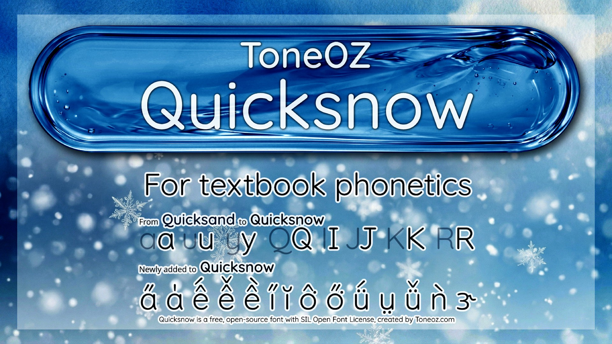
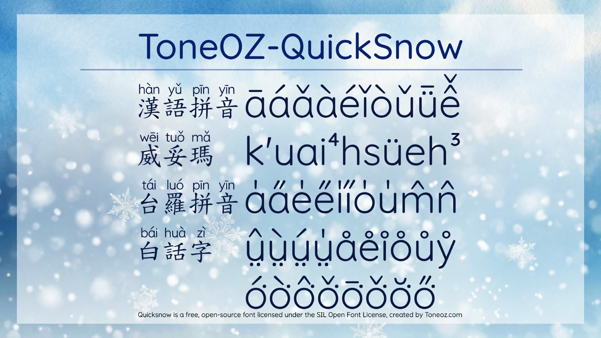
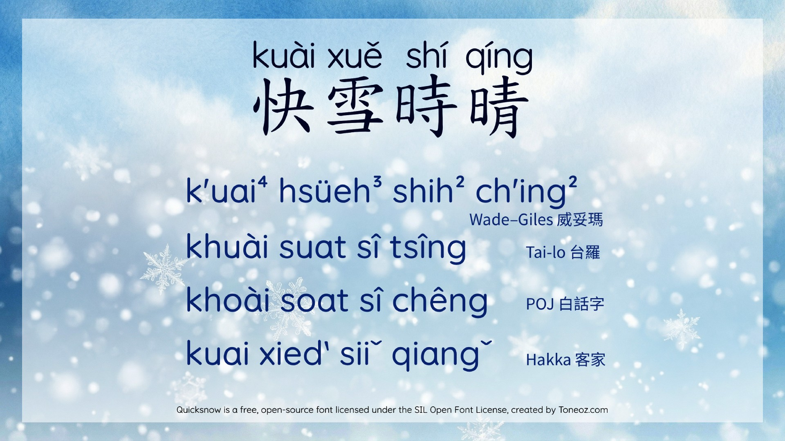
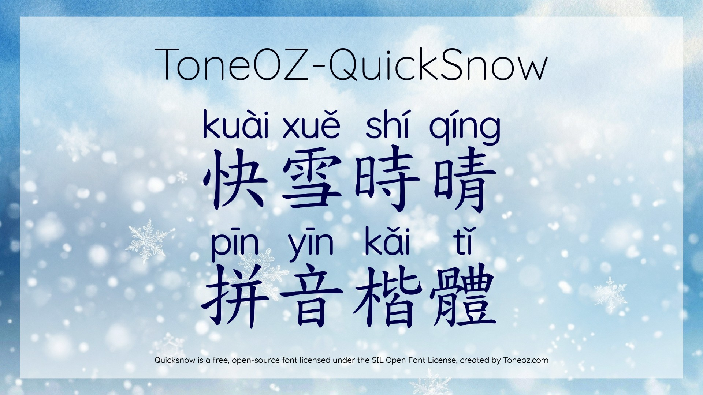
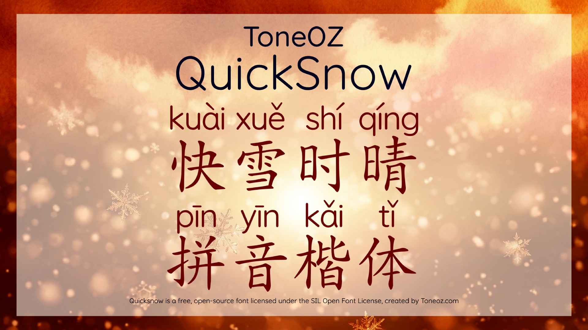

# ToneOZ QuickSnow

**ToneOZ QuickSnow** is a free and open-source font family created by [ToneOZ.com](https://toneoz.com), released under the **SIL Open Font License**.

Phonetic typefaces that deliver a textbook-quality reading experience and support a wide range of educational romanized phonetic annotation characters.

---

## Demo

Quicksnow web font live demo:

[https://toneoz.com/demo_quicksnow/](https://toneoz.com/demo_quicksnow/)

---

## Download Fonts

[https://toneoz.com/blog/quicksnow](https://toneoz.com/blog/quicksnow)

---
## Your support

If ToneOZ has been useful to you, please consider sharing your experience in your own words on any website, blog, social media, forum, newsletter, or magazine. Any language is welcome. Honest feedback from real users means a great deal to the creator.

---
## Contact 

- Author: Jeffrey Xuan [jeffreyx@gmail.com](mailto:jeffreyx@gmail.com)
- Facebook group: [曉聲通國語字典](https://www.facebook.com/groups/apptoneoz)
- WeChat: [chihlinhsuan](https://weixin.qq.com/)
- LINE: [jeffreyxiphone2018](https://line.me/)

---
## Overview

The **QuickSnow** series is designed for a wide range of educational use cases, especially phonetic annotation in teaching materials.

Fonts in the family include:

- [x] **ToneOZ-Quicksnow** — half-width Latin letters and numerals
- [x] **[ToneOZ QuickSnow Phonetic Kai Traditional Chinese](https://github.com/jeffreyxuan/toneoz-font-quicksnow-pinyin-kai-traditional)**
- [x] **[ToneOZ QuickSnow Phonetic Kai Simplified Chinese](https://github.com/jeffreyxuan/toneoz-font-quicksnow-pinyin-kai-simplified)**

---

## How to build

1. Make sure `python3` is available in your environment.
2. Run `build.bat`.

---

## Designed for Education

The phonetic Kai fonts for Traditional and Simplified Chinese combine Quicksnow with education-oriented standard Kai typefaces. They support multiple pronunciations for a single character through the widely used IVS-based phonetic annotation specification (字嗨注音 IVS), and are designed for practical classroom use.

---

## Phonetic editor

The QuickSnow family also works together with the free online phonetic editor:

**ToneOZ IME**  
https://toneoz.com/ime

Features of the editor include:

- automatic correction of polyphonic heteronyms characters
- support for both **Pǔtōnghuà (普通话 Common Tongue)** and **Guóyǔ (國語 National Language)**
- no installation required

---

## Free and Open Source

- [x] Design philosophy inspired by Morisawa’s Japanese textbook font [UD Gakusan Maru Gothic](https://www.morisawa.co.jp/topic/udgakusanrgo/).
- [x] Structure and character planning inspired by the open-source font [Lesson One](https://github.com/ButTaiwan/LessonOne) from Zi Hai.
- [x] Derived from the open-source Google font **Quicksand**
- [x] Partly mixed with **Noto Sans**
- [x] Free to use, including commercial use
- [x] Released under the **SIL Open Font License**

---

## Key Features

ToneOZ proudly presents the **QuickSnow** phonetic font series.

### Visual and educational design

- [x] Designed to feel familiar in educational materials — “like a real textbook”
- [x] Rounded stroke endings for a softer and clearer appearance
- [x] Enlarged glyph area for better visibility
- [x] Clear stroke shapes for easy recognition
- [x] Strong visual separation from body text, so learners can immediately identify phonetic information
- [x] East Asian phonetic-teaching oriented letterforms
- [x] High legibility even at small sizes

### Font technology

- [x] Supports **five static weights** : 300 Light, 400 Regular, 500 Medium, 600 Semi-bold, 700 Bold.
- [x] Supports **SIL 1.8 variable weight**, allows smooth and flexible weight adjustment
- [x] For the Kai version : Uses dynamic-width layout for phonetic text above Chinese characters, providing a more natural reading experience for Latin-based phonetic annotation

---

## Why This Font Was Made

Phonetic symbols are widely used to indicate pronunciation in educational materials.  
In many textbooks and learning resources, the body text is often set in serif or traditional sans-serif styles. For phonetic annotation, however, publishers often prefer a **rounded style** to visually distinguish pronunciation from the main text.

This distinction helps readers immediately understand that the phonetic text is supplementary pronunciation information, not body content.

At the same time, phonetic fonts for education should:

- emphasize handwritten-style educational letterforms
- avoid overly sharp, decorative, or high-contrast details
- remain simple, clear, and easy to recognize
- support all characters required by teaching standards

A well-known reference in this design direction is the Japanese **Morisawa UD textbook font** series.

For general use, phonetic fonts must also support the full set of characters used in **Mandarin**, **Hokkien**, and **Hakka** phonetic systems.

As of 2026, access to rounded educational phonetic fonts that meet these requirements is still limited. Commercial publishers may commission custom typefaces, but smaller educational teams and independent creators often face significant difficulty when creating phonetic educational materials.

**ToneOZ QuickSnow** was created to help the above situations.

---

## Background

ToneOZ QuickSnow is adapted from **Quicksand**, an open-source typeface originally initiated in 2008 by Dubai-based Filipino designer **Andrew Paglinawan**.

It was later improved in 2016 by Irish-Egyptian designer **Thomas Jockin**, and a variable-weight version was produced in 2019 by New York-based Yugoslav designer **Mirko Velimirovic**.

Thanks to this diverse development history, Quicksand offers strong support for Western and Southern European Latin scripts as well as Vietnamese.

The main focus of the **ToneOZ QuickSnow** adaptation is:

- expanding support for Mandarin, Hokkien, and Hakka phonetic characters
- adjusting letterforms for classroom teaching needs
- improving suitability for educational phonetic annotation

---

## License

This project is released under the **SIL Open Font License**.

---

## Website

Learn more at:  
https://toneoz.com

### Character support

- [x] Supports special characters used in educational phonetic systems
- [x] Includes tone marks and related phonetic symbols
- [x] Expanded support for Mandarin, Hokkien, and Hakka phonetic notation

漢語拼音

āáǎàēéěèīíǐìōóǒòūúǔùüǖǘǚǜêê̄ếê̌ềm̄ḿm̌m̀n̄ńňǹ
ĀÁǍÀĒÉĚÈĪÍǏÌŌÓǑÒŪÚǓÙÜǕǗǙǛÊÊ̄ẾÊ̌ỀM̄ḾM̌M̀N̄ŃŇǸ

台語組合

◌́◌̀◌̂◌̌◌̄◌̍◌̋◌̆◌͘
a̍a̋e̍e̋i̍i̋o̍u̍m̀m̂m̌m̄m̍m̋m̆n̂n̄n̍n̋n̆
A̍A̋E̍E̋I̍I̋O̍U̍M̀M̂M̌M̄M̍M̋M̆N̂N̄N̍N̋N̆

台語預組

áàǎâāăéèêěēĕíìîǐīĭóòôǒōőŏúùûǔūűŭḿńǹňⁿ
ÁÀÂǍĀĂÉÈÊĚĒĔÍÌÎǏĪĬÓÒÔǑŌŐŎÚÙÛǓŪŰŬḾŃǸŇᴺ

三種順序

o͘ó͘ò͘ô͘ǒ͘ō͘o̍͘ŏ͘ő͘
O͘Ó͘Ò͘Ô͘Ǒ͘Ō͘O̍͘Ŏ͘Ő͘

ó͘ò͘ô͘ǒ͘ō͘o̍͘ŏ͘ő͘
Ó͘Ò͘Ô͘Ǒ͘Ō͘O̍͘Ŏ͘Ő͘

ó͘ò͘ô͘ǒ͘ō͘o̍͘ŏ͘ő͘
Ó͘Ò͘Ô͘Ǒ͘Ō͘O̍͘Ŏ͘Ő͘
